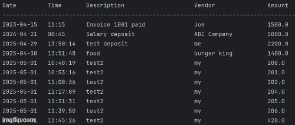

# Financial Tracker

## Track your Payments, Deposits, and a look at a Full Ledger

Track your payments and deposits in full detail, date, time, description, vendor and amount. Also included is a ledger where you can search by month, year, and vendor. This makes it easy to keep track of all your exspenses in one location.

## User Stories

- User wants to be able to see add deposit, make payment, ledger, and exit on the home screen
- User wants the ledger screen where you can see the options to display all entries, deposits, payments, reports, home.
- User wants another sub menu in the reports section of the ledger to sort through data by month to date, previous month, ytd, previous year, search by vendor, and have the ability to go back to the ledger

## Setup
Start the program by hitting the play button in the upper right of the Intellij window
follow the prompts shown in the command 

### Prerequisites

- IntelliJ IDEA: Ensure you have IntelliJ IDEA installed, which you can download from [here](https://www.jetbrains.com/idea/download/).
- Java SDK: Make sure Java SDK is installed and configured in IntelliJ.

### Running the Application in IntelliJ

Follow these steps to get your application running within IntelliJ IDEA:

1. Open IntelliJ IDEA.
2. Select "Open" and navigate to the directory where you cloned or downloaded the project.
3. After the project opens, wait for IntelliJ to index the files and set up the project.
4. Find the main class with the `public static void main(String[] args)` method.
5. Right-click on the file and select 'Run 'YourMainClassName.main()'' to start the application.

## Technologies Used

- Java: Mention the version you are using.

## Demo

This gif shows the different menus and screens within the app.

## Future Work

Things I would add if I had the time:

- Balance tracker to show the current value of the account 
- Change the colors for titles so it stands out more

## Resources

These are the resources I used to help me complete this code

- [W3 writing to a file](https://www.w3schools.com/java/java_files_create.asp)
- [W3 Method Structures](https://www.w3schools.com/java/java_methods_param.asp)

## Thanks to

All my fellow Year Up teammates for their dedication, teamwork, continuous support, and guidance throughout this project.